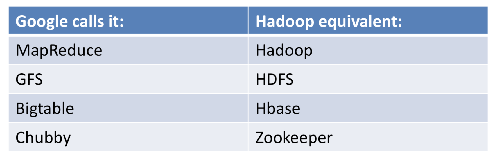
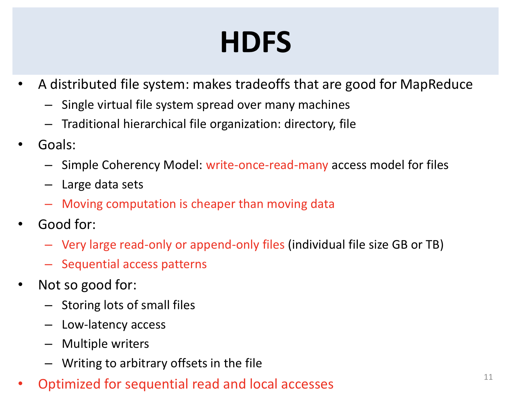
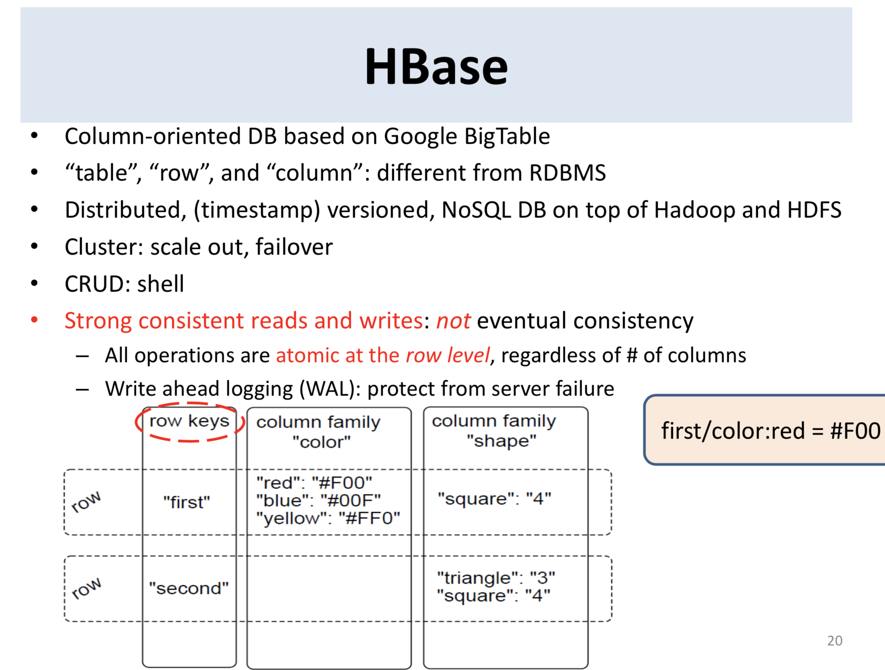
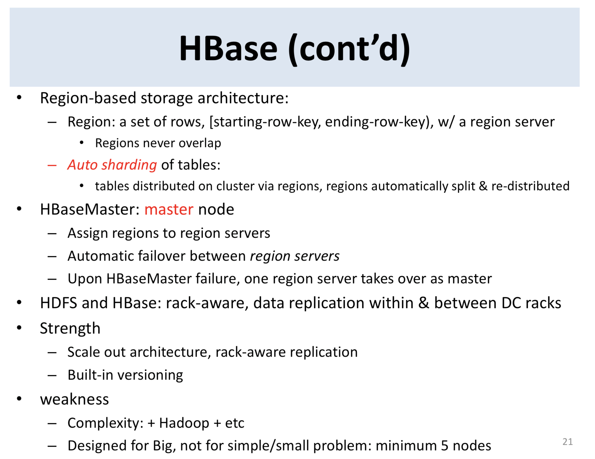

# Apache Hadoop Goes Realtime at Facebook

[link](https://www.dropbox.com/s/z6l80gckcwqpcw4/RealtimeHadoopSigmod2011.pdf?dl=0)

## Abstract

* Facebook recently deployed Facebook Messages, its first ever user-facing application built on the Apache Hadoop platform.

* This paper describes the reasons why Facebook chose Hadoop and HBase over other systems such as Apache Cassandra and Voldemort

* how this solution has significant advantages over the sharded MySQL database scheme used in other applications

* We offer these observations on the deployment as a model for other companies who are contemplating a Hadoop-based solution over traditional sharded RDBMS deployments

## 1. Introduction

### Naming comparison between Google and Hadoop (adopted from Prof. Kong Li's slide)

* less emphasis on making Hadoop performant for **random access** workloads by providing low latency access to HDFS.

* A new generation of applications has arisen at Facebook that require very high write throughput and cheap and elastic storage, while simultaneously requiring low latency and disk efficient sequential and random read performance. MySQL storage engines are proven and have very good random read performance, but typically suffer from low random write throughput.

### Pros and Cons for HDFS (adopted from Prof. Kong Li's slide)

## 2. Workload Types

* These use cases would have workloads that are challenging to scale because of very high write throughput, massive datasets, unpredictable growth, or other patterns that may be difficult or suboptimal in a sharded RDBMS environment.

### 2.1 Facebook Messaging

#### 2.1.1 High Write Throughput

* The denormalized requirement would further increase the number of writes to the system as each message could be written several times

#### 2.1.2 Large Tables

* messages would not be deleted unless explicitly done so by the user, so each mailbox would grow indefinitely.

* With this type of random write workload, write performance will typically degrade in a system like MySQL as the number of rows in the table increases

#### 2.1.3 Data Migration

* One of the most challenging aspects of the new Messaging product was the new data model.

* The ability to perform large scans, random access, and fast bulk imports would help to reduce the time spent migrating users to the new system.

### 2.2 FacebookInsights

#### 2.2.1 Realtime Analytics

* The insights teams wanted to make statistics available to their users within seconds of user actions rather than the hours previously supported.

#### 2.2.2 High Throughput Increments

* To support the existing insights functionality, time and demographic-based aggregations would be necessary.

### 2.3 FacebookMetricsSystem(ODS)

* At Facebook, all hardware and software feed statistics into a metrics collection system called ODS (Operations Data Store). For example, we may collect the amount of CPU usage on a given server or tier of servers, or we may track the number of write operations to an HBase cluster. For each node or group of nodes we track hundreds or thousands of different metrics, and engineers will ask to plot them over time at various granularities.

#### 2.3.1 Automatic Sharding

* The massive number of indexed and time-series writes and the unpredictable growth patterns are difficult to reconcile on a sharded MySQL setup.

#### 2.3.2 Fast Reads of Recent Data and Table Scans

## 3. Why Hadoop And HBase

1. Elasticity: We need to be able to add incremental capacity to our storage systems with minimal overhead and no downtime. In some cases we may want to add capacity rapidly and the system should automatically balance load and utilization across new hardware.

2. High write throughput: Most of the applications store (and optionally index) tremendous amounts of data and require high aggregate write throughput.

3. Efficient and low-latency strong consistency semantics within a data center: There are important applications like Messages that require strong consistency within a data center. This requirement often arises directly from user expectations. For example  unread  message counts displayed on the home page and the messages shown in the inbox page view should be consistent with respect to each other.

4. Efficient random reads from disk: a lot of accesses miss the cache and hit the back-end storage system. MySQL is very efficient at performing random reads from disk and any new system would have to be comparable.

5. High Availability and Disaster Recovery: examples of the former being events like software upgrades and addition of hardware/capacity and the latter exemplified by failures of hardware components.

6. Fault Isolation: Individual databases can and do go down, but only a small fraction of users are affected by any such event.

7. Atomic read-modify-write primitives: lockless concurrent applications

8. Range Scans: For example all the last 100 messages for a given user or the hourly impression counts over the last 24 hours for a given advertiser.

Non-requirements:

1. Tolerance of network partitions within a single data center: MySQL servers may all be located within a few racks, and network partitions within a data center would cause major loss in serving capabilities therein. **Hence every effort is made to eliminate the possibility of such events at the hardware level by having a highly redundant network design.**

2. Zero Downtime in case of individual data center failure:

3. Active-active serving capability across different data centers: Latency (when user and data locality did not match up) could be masked by using an application cache close to the user.

* HBase is massively scalable and delivers fast random writes as well as random and streaming reads. It also provides row-level atomicity guarantees, but no native cross-row transactional support. From a data model perspective, column-orientation gives extreme flexibility in storing data and wide rows allow the creation of billions of indexed values within a single table. HBase is ideal for workloads that are write-intensive, need to maintain a large amount of data, large indices, and maintain the flexibility to scale out quickly.

### HBase (adopted from Prof. Kong Li's slide)

## 4. Realtime HDFS

* MapReduce application that are inherently batch systems and where scalability and streaming performance are most critical. We have seen the advantages of using HDFS: its linear scalability and fault tolerance results in huge cost savings across the enterprise.

### 4.1 HighAvailability-AvatarNode

* The design of HDFS has a single master   the NameNode. Whenever the master is down, the HDFS cluster is unusable until the NameNode is back up. This is a single point of failure and is one of the reason why people are reluctant to deploy HDFS for an application whose uptime requirement is 24x7.

#### 4.1.1 Hot Standby - AvatarNode

* At startup time, the HDFS NameNode reads filesystem metadata from a file called the fsimage file.

* NameNode does not persistently store the locations of each block. Thus, the time to cold-start a NameNode consists of two main parts: 
**1. firstly, the reading of the file system image, applying the transaction log and saving the new file system image back to disk;
**2 secondly, the processing of block reports from a majority of DataNodes to recover all known block locations of

* In total, a cold-restart takes about 45 minutes. The failover times for the BackupNode solution can be as high as 20 minutes. Our goal is to do a failover within seconds.

* Another problem is that the NameNode synchronously updates the BackupNode on every transaction, thus the reliability of the entire system could now be lower than the reliability of the standalone NameNode.

* The DataNodes talk to both Active AvatarNode and Standby AvatarNode instead of just talking to a single NameNode. That means that the Standby AvatarNode has the most recent state about block locations as well and can become Active in well under a minute. The Avatar DataNode sends heartbeats, block reports and block received to both AvatarNodes.

* AvatarDataNodes are integrated with ZooKeeper and they know which one of the AvatarNodes serves as the primary and they only process replication/deletion commands coming from the primary AvatarNode. Replication or deletion requests coming from the Standby AvatarNode are ignored.